# Procesverslag
Markdown is een simpele manier om HTML te schrijven.  
Markdown cheat cheet: [Hulp bij het schrijven van Markdown](https://github.com/adam-p/markdown-here/wiki/Markdown-Cheatsheet).

Nb. De standaardstructuur en de spartaanse opmaak van de README.md zijn helemaal prima. Het gaat om de inhoud van je procesverslag. Besteedt de tijd voor pracht en praal aan je website.

Nb. Door *open* toe te voegen aan een *details* element kun je deze standaard open zetten. Fijn om dat steeds voor de relevante stuk(ken) te doen.

## Jij

  
uitwerken voor kick-off werkgroep

  ### Auteur:
  Charlotte Middelkamp

  #### Je startniveau:
  Blauw

  #### Je focus:
  Responsive
 

## Je website

  
uitwerken voor kick-off werkgroep

  ### Je opdracht:
  Dunkin https://www.dunkin.nl/

  #### Screenshot(s) van de eerste pagina (small screen): 
  Home page 
  

  #### Screenshot(s) van de tweede pagina (small screen):
  bestel page  
  
 

## Toegankelijkheidstest 1/2 (week 1)

  
uitwerken na test in 2e werkgroep

  ### Bevindingen
  Lijst met je bevindingen die in de test naar voren kwamen:

  1. De site is gemaakt in een online webmaker, waardoor de hele code niet semantisch is. 
  2. Er zijn gewoon geen headers??
  3. Als je er met de screenreader doorheen gaat, is het heel confusing.
  4. Veel alt tags kloppen niet of zijn er gewoon niet. 
  5. Er wordt niet duidelijk aangekondigd waar je eigenlijk bent op de pagina. Ik ging er doorheen en opeens begint het ding allemaal cijfers te vertellen. Dit was een plaatje dat dus ook niet goed was neergezet.
  6. Tekst staat gewoon los in een divje.
  7. De contrast is te laag bij hun 'p's. Het is lichtgrijs op een witte achtergrond. het had een score van onder de 2.
  

<a href="FED 23-24 - Blok 1 - WCAG checklist.pdf">Link naar het testverslag</a>

## Breakdownschets (week 1)

  
uitwerken na afloop 3e werkgroep

  ### de hele pagina: 
  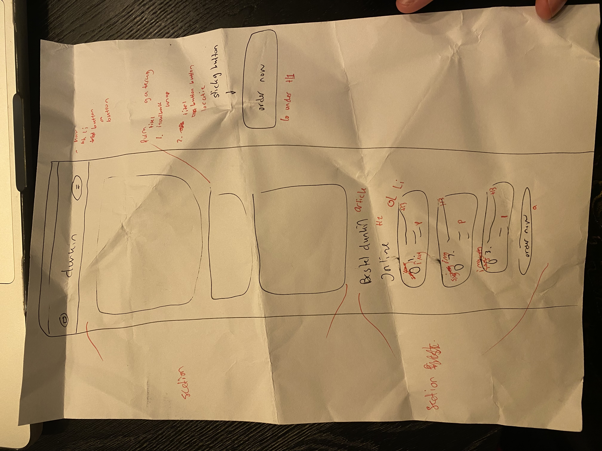

  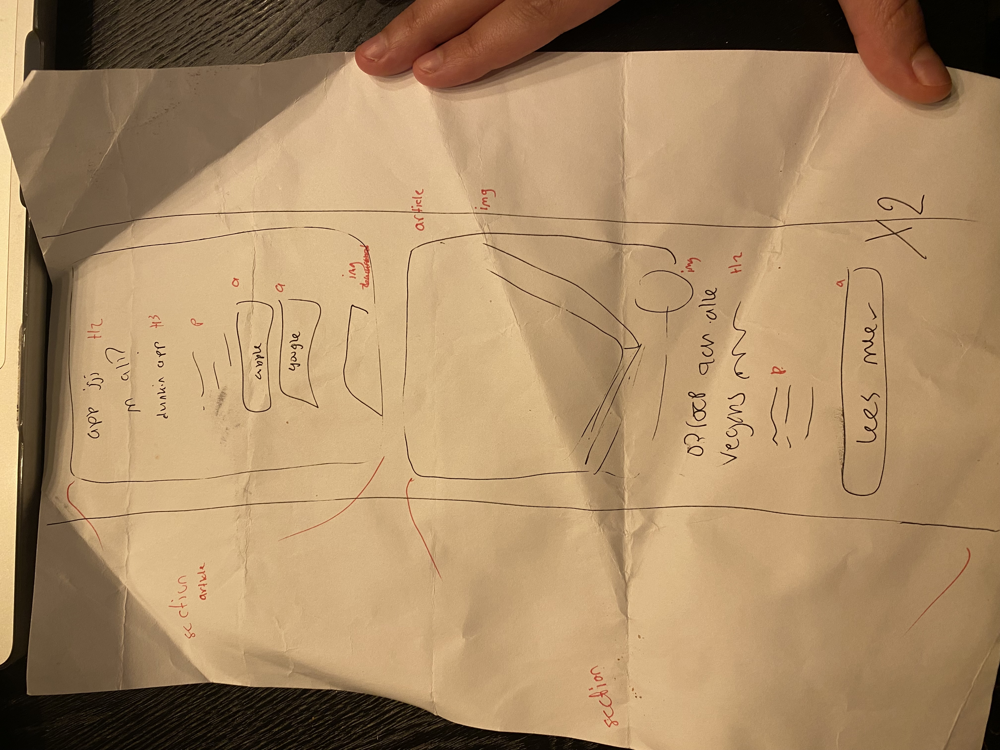

  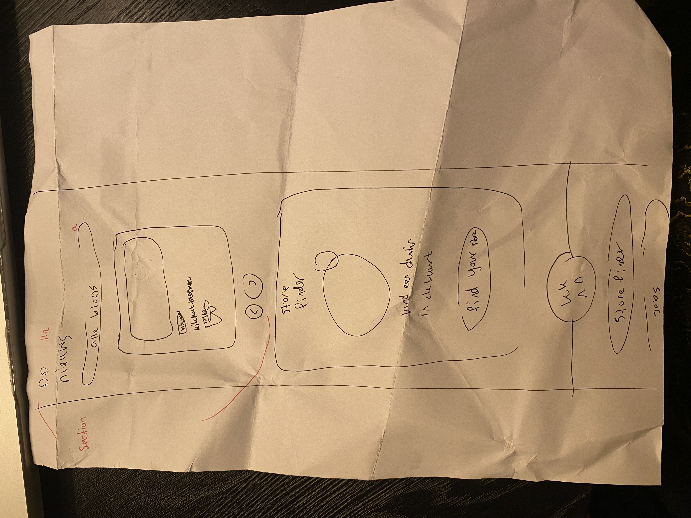

  

  ### desktop: 
  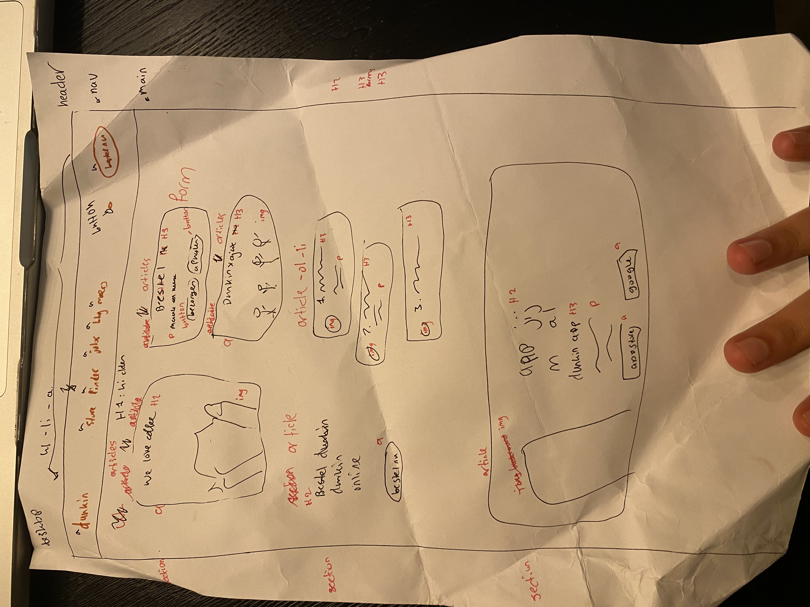

## Voortgang 1 (week 2)

  
uitwerken voor 1e voortgang

  ### Stand van zaken

  hier dit ging goed & dit was lastig (neem ook screenshots op van delen van je website en code)

  Ik vind coderen opzich gewoon echt lastig en het enige wat goed ging was de de sections beslissen van mijn breakdown schets. Ik ben niet vergekomen met mijn site. Ik sla een dagje over en opeens mis ik een hele week. Wat ik vooral lastig vind, is dat ik bijna niks uit de site kan halen die ik gekozen heb. Ik snap niks van de code die daar staat, dus ik moet alles zelf doen. Ik probeerde ook een form te maken die aan het begin staat, maar ik zocht wat uitleg op en dergelijke, maar ik vind het echt lastig. 
  Ik heb al maanden niet gewerkt aan css, dus dit vond ik ook heel lastig om te doen. Ik zag de blokjes van de site en kon helemaal niet bedenken hoe ik dat moest namaken.

  navbar

  Wat niet goed ging, was het maken van  mijn navbar. Het was lastig om alle items goed te positioneren. Ik probeerde alle justify-content, maar niks werkte. Ik weet niet wat er mis ging, maar ik heb uiteindelijk besloten om mijn oude navbar van mijn eerder gemaakte site te kopieren en te plakken. 

  Toen heb ik een paar dingetjes aangepast om het passend te maken en het probleem was volgensmij dat ik de verkeerde tags aanriep. De flex werkte toen wel, maar hij zat nog naar rechts. Ik zat alles te bekijken en vond toen dat mijn ul een standaard padding had. Ik had dit eerst niet bedacht, omdat ik de bolletjes van de ul al had verwijderd. 

 
  Daarna was het dus vooral opstarten met weer css schrijven. Ik dacht niet te veel aan of het netjes was, maar eerder of het wel werkte.

  Eerste blokje coffee

  Daarna ging ik het blokje maken voor de koffie. Ik kon eerst niet uitvogelen hoe ik het precies moest stylen, dus heb ik de originele site bekeken en de css daarvan gepakt, en hem een beetje aangepast. Vanuit daar heb ik eigenlijk de hele code weer aangepast toen ik meerdere dingen moest toevoegen. Daarna had ik problemen met de content in het blokje. Het positioneerde niet goed. Ik was met flex en met grid bezig, maar niks werkte. Het probleem bleek de margin de zijn die de browser gaf. Verder had ik mijn koffie img die eruit viel. Lua hielp hier met overflow.
  
   
  sticky button

  Ik wist eerst niet hoe ik het goed moest positioneren. Ik had in de orginele css gekeken, maar hier kwam ik niet mee verder, want ik snapte de css niet. Ik heb een beetje online rondgekeken en kwam dus met sticky. voordat ik position absolute heb gebruikt, heb ik sticky geprobeerd, maar dat werkt niet omdat het plakt aan de container. ik moet hiervoor dus fixed gebruiken. Daarna had ik problemen met flex en fixed. Dit heb ik opgelost door beide de a en de containter een flex en fixed te geven.

  Daarna heb ik mijn css goed neergezet met kopjes en dergelijke.
 

  ### Agenda voor meeting

  | student 1      |
  | Hoe werkt grid en is mijn html goed ingedeeld       |
  

  ### Verslag van meeting
  hier na afloop snel de uitkomsten van de meeting vastleggen

  - Mijn nav stond verkeerd, mijn menu balk items zijn in principe niet de nav, maar de nav zit onder de hamburger
  - de manier waarop ik mijn menubalk heb gestijld kan handiger met grid, hiervoor uitleg gekregen
  - Uitleg gekregen over hoe ik mijn form in kan delen en hoe ik dit kan vormgeven in cs
  - ook punten gegeven over dat ik bepaalde content anders kan neerzetten omdat de originele site het op een confusing manier doet

  ### Voortgang na meeting

grid header

Na de meeting ben heb ik mijn header veranderd. Mijn nav was ergens anders en dat betekende dat de css ook anders moest. Ik ben van flex naar grid gegaan. Dit moest ik ook uitvogelen. Eerst moest ik opzoeken hoe ik eigenlijk de grid moest maken, maar ik vond dat lastig, dus heb ik om hulp gevraagd bij de docent. Hij had al instructies gegeven maar die werkten niet. We heb samen ernaar gekeken. De grid klopte niet, er was een rij bijgekomen. Het probleem was dat we in de css de html verkeerd hadden aangeroepen.

 

## Voortgang 2 (week 3)

  
uitwerken voor 2e voortgang

  ### Stand van zaken

  Grid werk sectie

  ik heb voor een sectie (roze) grid gebruikt. Dit was nog best uitzoeken, maar ging wel redelijk. Het lastigste was om de positionering binnen de grid zelf goed te zetten en dergelijke. Had veel met margins eerst gewerkt. Moest ook uitvogelen hoe een element over meerdere kolommen heen kon. Had eerst span, maar docent zei dat start en end netter is. De buttons stonden nog niet goed.

  2de roze button

  Hier was het vooral strugglen met het centreren en de grote, maar kwam er al snel uit.

  bekijk de css

  Heb daarna mijn css bekeken om het wat netter te maken

  header styling

  heb mijn nav gestyled. dit ging best gemakkelijk, maar heb nog niet gewerkt aan een werkende hamburger. HEt enige probleem is dat de container tot de header gaat en mijn header niet fixed is. Heb dit vaker geprobeerd, maar het lukt me maar neit om de css dat weer goed te zetten. Je kan dus nog scrollen achter de nav.

  root en algeme styling button

  Ik merkte dat ik vaak dezelfde code had voor mijn oranje knop. Heb voor nu het een class gegeven en heb gewerkt aan root en algeme styling.

  favicon opgelsot

  Ik wist eerst niet wat deze melding was, maar blijkbaar het kleine icoontje bovenin. Met behulp van docent hebben we de jusite svg gepakt en in de code gezet.

  ### Agenda voor meeting
  samen met je groepje opstellen

  | student 1      | 

 

  ### Verslag van meeting
  hier na afloop snel de uitkomsten van de meeting vastleggen(brianne heeft geholpen)

  - form , verschillende secties aangeven met js
  - hamburger, min positie , met javascript goedzetten en dan met transitite
  - transaprante header naar links, geef ze goede titel
  - button aria label (vertel wat gaat doen)
  - hamburger decoratief
  - geef plaatjes in readme width.
  - html in orde,
  - globaal werken en dan kleiner

  ### Stand van zaken

Alt en aria

Ik heb alles dat nog geen label had een label en alt gegeven. Verder heb ik ook goed gelet op decoratieve alts.

## Toegankelijkheidstest 2/2 (week 4)

  
uitwerken na test in 9e werkgroep

  ### Bevindingen
  Lijst met je bevindingen die in de test naar voren kwamen (geef ook aan wat er verbeterd is):

  - section in header een divke, want is puur om de vormgeving
  - id's in mijn labels
  - miste een heading bij een article
  - meer focus toevoegen
  - als ik tab doe voor focus, gaat hij van de pagina af en hij pakt niet alle buttons
  - tabindex doet het niet
  - voeg skip link toe

<a href="FED 23-24 - Blok 1 - WCAG checklist.pdf">Link naar het testverslag</a>

## Voortgang 3 (week 4)

  
uitwerken voor 3e voortgang

  ### Stand van zaken
  hier dit ging goed & dit was lastig (neem ook screenshots op van delen van je website en code)

Achtegrondkleur

Ik wilde de achtergrond een kleur geven, maar ik had een margin/padding op de body die ik niet wegwilde. Hierdoor ging al mijn css kapot en ik wist niet hoe ik dit goed moest oplossen, omdat veel ervan al lastig was om te maken (voor mij). Heb gegeken of achtegrond kleur kan worden overriden en dergelijke, maar dat is me niet gelukt en het kan ook niet echt. Er zijn verschillende bg kleuren per secties, maar ze gingen dus niet over de hele pagina. Ik heb uiteindelijk een background linear gradient toegevoegd aan de body, zodat ik niet veel hoeft aan te passen.

 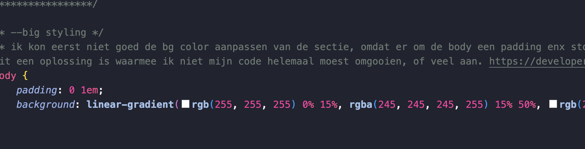

line height

Bepaalde tekst stond te dicht op elkaar, dus heb opgezocht en line height toegepast.

Span

Om de styling goed te krijgen voor een woord binnen een regel tekst, dan kan er niet veel anders dan een span worden gebruikt. 

 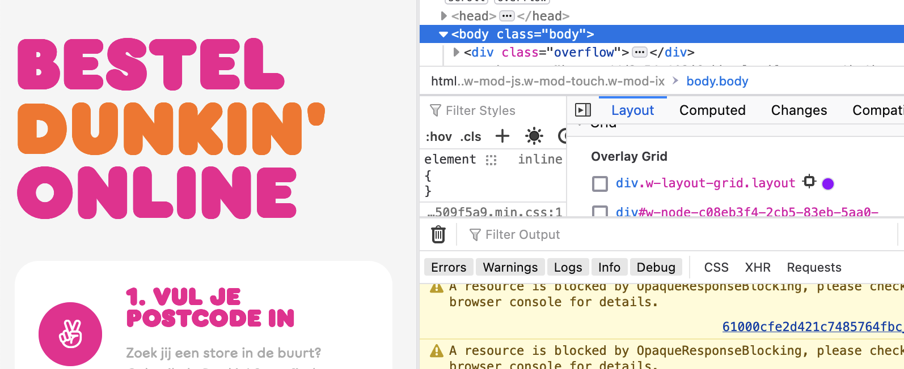

gridwerk sectie 3

Om blokjes erin te zetten heb ik met grid proberen te werken. Dit ging wel goed, maar had wat probleempjes. Ik had wat gewerkt met margin. probeerde vervolgens de margin weg te halen, maar met een grid over de hele sectie knoeide het met het andere grid en alles zat in de eerste. dan de grootte van de li, wilde de margin niet gebruiken, maar kon niets vinden. Toen dacht ik dat ik het grid een em-grootte kon geven + de grootte van de kolom in % kon veranderen om een ​​juist padding effect te krijgen.

 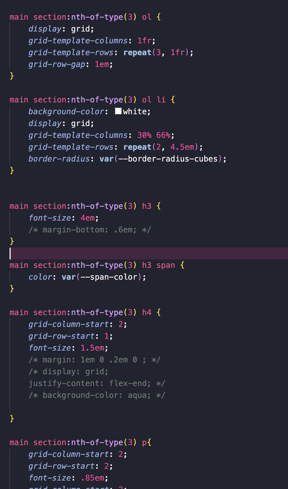

blog posts

Daarna gewerkt aan de blog posts. Heb met flex gewerkt. Img op -1 order gezet om bovenaan te zetten. dvg icon zit op - margin omdat het overlapt met de andere.

 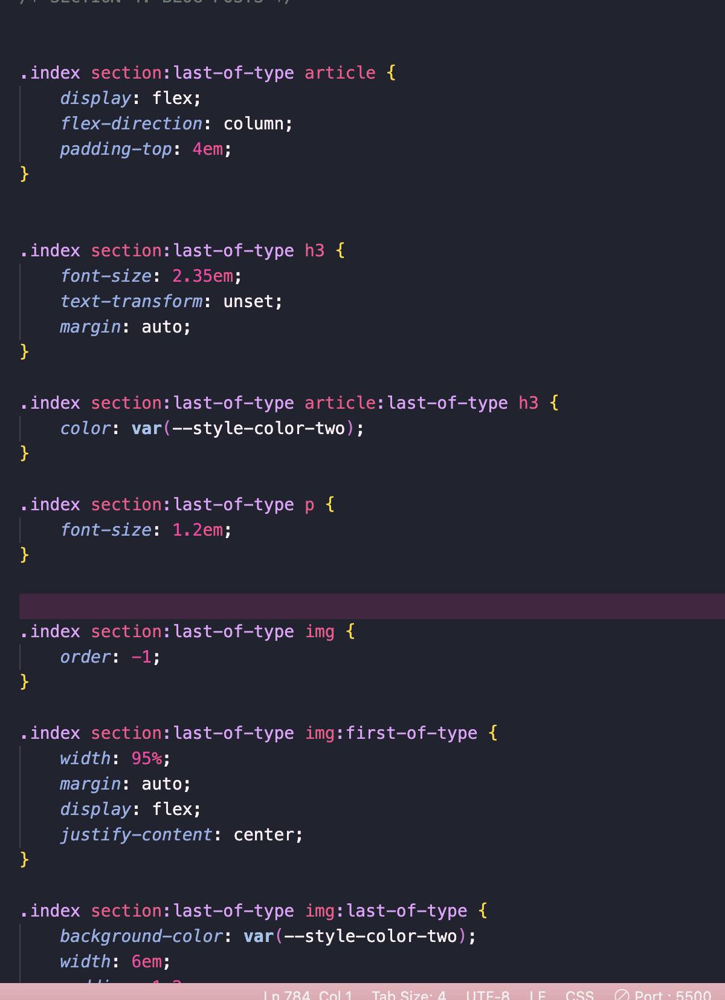

Footer

De achtegrond hier had hetzelfde probleem en ik kon geen oplossing vinden behalve - margin. logo erin gezet en zindex toegevoegd omdat het over alles heen ging. Daarna gewerkt aan de buttons. Had problemen met de gap, bleek dat ik werkt op de verkeerde selector. 

 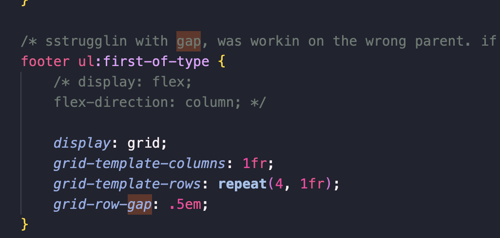

styling

root en derglijke aangepast. kleure pink and orange style 1 en 2, betere benaming en meer dingen root. Svg icon styling in general styling gedaan.

sections form

toen ik probeerde secties aan het formulier toe te voegen, werkte het gewoon niet, omdat het met mijn selectors knoeide. er is nog steeds ruimte voor verbetering in mijn selector, maar ik heb een paar dingen opgelost. andere secties reageerden erop. ik veranderde het van nth-of naar of-child, maar dat werkte niet in sectie 2. maar de sticky button is ook uitelaar gevallen. i changed the selector to a sibling selector and it worked. Daarna was de form zelf alleen nog uitelkaar gevallen. selector aangepast. eerst met class geprobeerd en toen class verwijderd. was niet helemaal zoals het oude. de width wilde niet meedoen dus moest die aanpassen. 

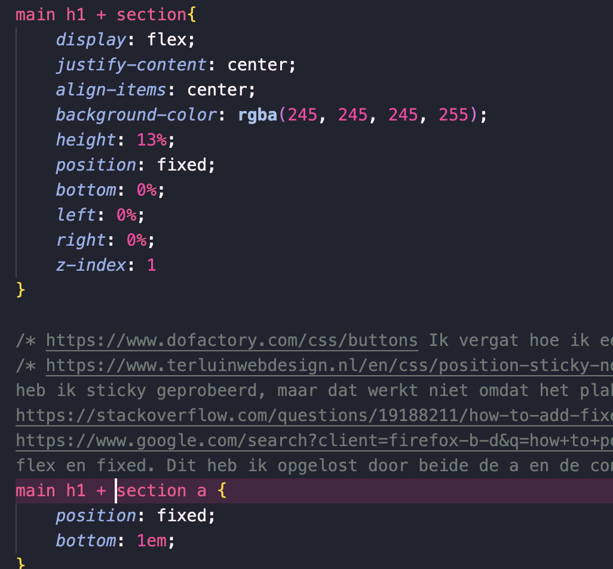

2e pagina
styling van achtegrond wil gwn niet veel struggel met margin dus heb opgegeven en - margin gedaan. 

section form opnieuw

Heb opnieuw de sections geprobeerd. Moest allemaal selectoren dus aanpassen en is me uiteindelijk gelukt.

Heb gewerkt aan javascript

Javascript om de secties te veranderen. Was even uitzoeken maar is me gelukt met display none display grid. 
js werkt niet helemaal maar hij doet het. heel veel dubble functies en de laaste goback klopt niet. beetje hamburger menu gedaan maar
js lukt alleen voor openen.

input en select

In een van de sections zit een input en een select. Heb de input gestyled en labels toegevoegd.

:focus
Heb focus toegevoegd aan interactie elementen. Je ziet het alleen bij de input en select. de tab index werkte niet helemaal en ging steeds van de pagina. Op andere laptop werkte die wel. Heb toen besloten om de tabindex eruit te halen, omdat het niet hielp.

  ### Verslag van meeting
  hier na afloop snel de uitkomsten van de meeting vastleggen

  - nav knop
  - nav js 
  - scrollbar eronder
  - hele struggle met javascript style display for nav enz en hamburger eindelijk oegslott
  - 

  ### Stand van zaken

nav js

studente assistente en docent hebben geholpen hiermee(Lua ook). Had eerst css in js gedaan. ik dacht dat alles goed ging maar andere button ging ook mee nadat ik mijn html heb aangepast. Heb toen mijn selectoren aagepast en het werkte. De js is nu met class toggle.

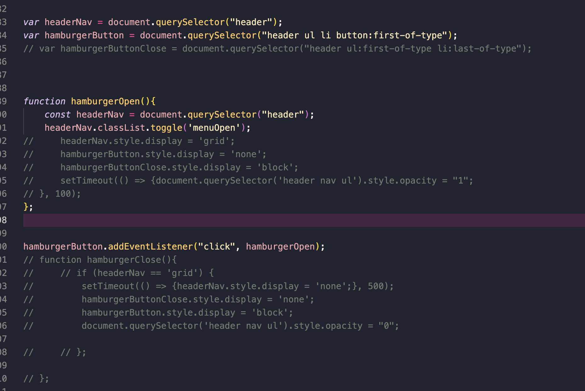

gewerkt aan class verwijderen

Ik had voor mijn oranje knopjes eerst een class gegeven, omdat ik geen zin had om al de selectoren neer te zetten, maar heb het nu goed gedaan.

nav fade in text

In de originele site zit er animatie bij de nav. Mijne is niet zo uitgebreid, maar vond het wel mooi om wat eraan toe te voegen. Heb opgezocht en kwam er direct op. Het is best makkelijk. keyframes voor opacity en dan aangeven wanneer en dergelijke.

gewerkt aan styling form en javascript want klopte niet

Ik had mijn form blokjes nog niet helemaal af, dus heb ze voor mijn tweede pagina afgemaakt. Toen kwam ik erachter dat mijn js niet werkte. Mijn functie met else if klopte niet en heb er ipv een anonieme funtie van gemaakt in de add event listener zoals bij mijn andere js.

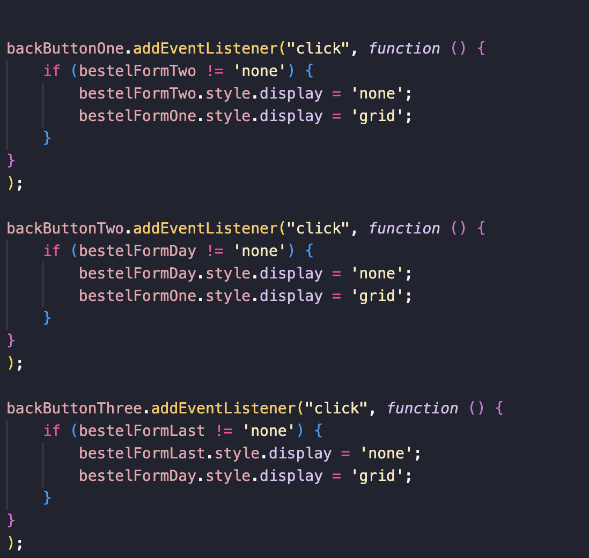

header scroll

We hebben ook gekeken naar de header die niet vast staat als je de nav opent, maar we hebben besloten om dat achter te laten.

color change

Ik heb de achtergrond kleur van de blokjes veranderd om betere contrast te hebben.

responsive werk

Ben eerst mijn breaking points gaan vinden, toen aan het werk gegaan met grids te plaatsen bij mijn secties. Dit ging wel redelijk, maar het roze blokje bleef irritant doen. Eerst de container zelf (vergat een width 100%), en daarna de content zelf. Hiervoor ben ik terug gaan kijken naar de de code voor mobile en ben van bepaalde elementen van em naar width gegaan. Hierdor bleef het iets mooier staan en schoof het ook mooier mee qua responsiveness. Toen probeerde ik ook om het te centreren en dat hielp.

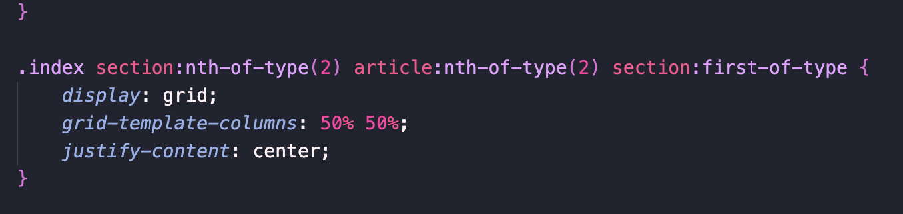

na sectie 1 ben ik verer gegaan met sectie 2. Dit was lastig, omdat de grid van de kleine blokjes ervoor zorgde dat hij niet in de article grid wilde. Heb hierbij veel dingen geprobeerd, zoals de mobile code te veranderen naar flex en de grid op parent containers te zetten, maar ik kwam er niet achter, en heb de vormgeving aangepast, zodat het tenminste er iets op lijkt.

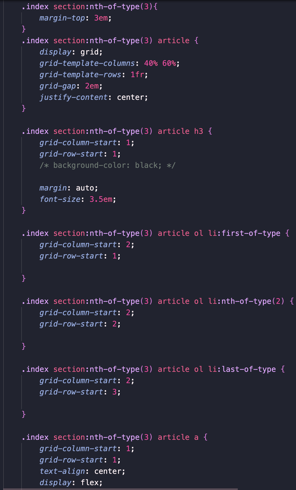

responsive werk verder

Ik wilde verder werken aan responsiveness, toen zag ik dat mijn code in blogposts opeens niet goed was. de img stond opeens onder. Had perongeluk iets random erboven getypt.

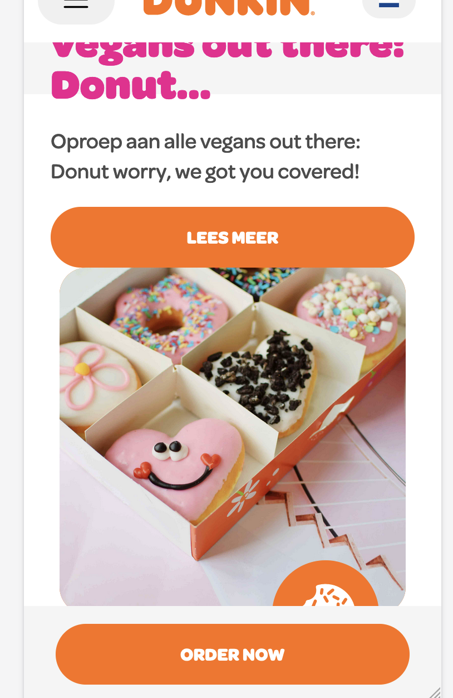

gewerkt aan de blogposts, grid ging wel oke, maar kreeg de img niet groter. Heb wel de tekst en button groter gelaten omdat op de originele site het heel klein is.

Responsive header

Daarna met de header aan eht werk bij mijn tweede media screen. Eerst wat styling aangepast en toen zag ik dat de nav niet mee werkte. Toen bedacht ik mee dat ik dus de js moest uitzetten. Heb online gekeken en heb gewerkt met window media max width, maar het hoeft helemaal niet, omdat de js wordt getriggered door een click die nu op display none staat. Moest alleen opacity aanpassen.

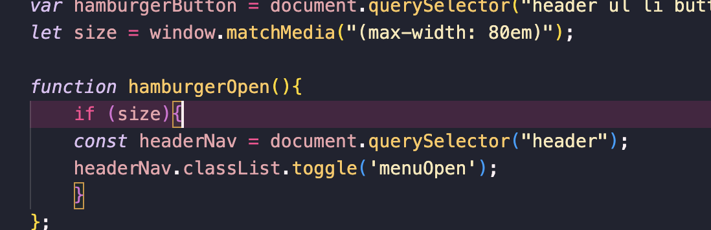

verder met resposnive ging allemaal wel goed. Veel spelen met andere height en dergelijke. Daarna nog een border bottom aan de header.

2e pagina responsive

Deze was wat makkelijker om te doen en ging best snel. Moest wel bij laaste media screen de body padding weer aanpassen omdat ik hem groter had gemaakt in de vorige.

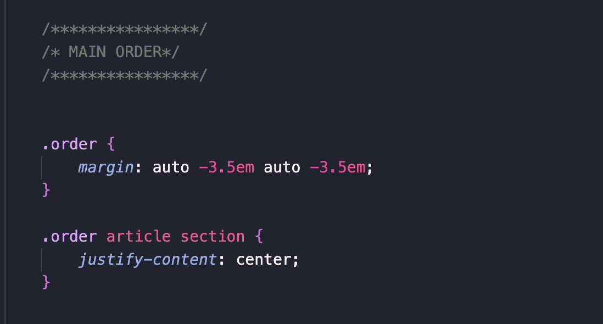

form verder maken

Daarna moest ik nog 2 sections van de form stylen op de 1ste pagina. Ik had het al op de 2e pagina, dus moest alleen kijken waar ik de selectoren moest neerzetten. Ik zette was selectoren neer, maar hij deed het niet. Het reageerde eerst op een andere sectie onderin, die eheb ik wat specifiecekr gemaakt zodat hij niet meer reageert. Daarna was het even uitzoeken. Hierna heb ik de styling ook toegepast aan de media queries.

## Eindgesprek (week 5)

  
uitwerken voor eindgesprek

  ### Je uitkomst - karakteristiek screenshots:
  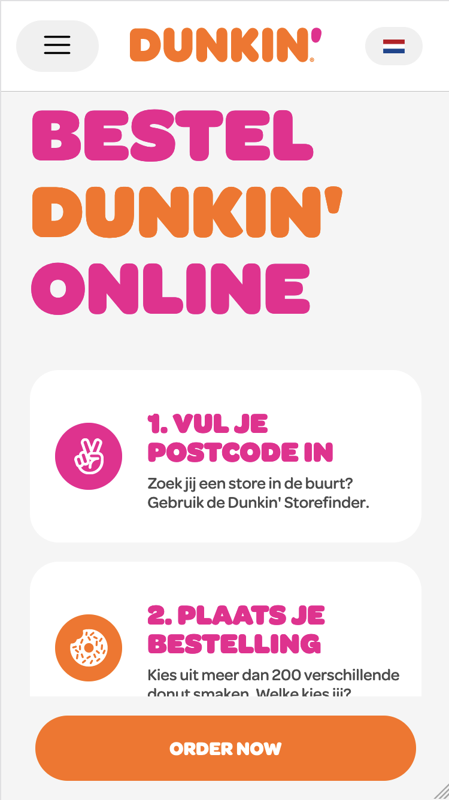
   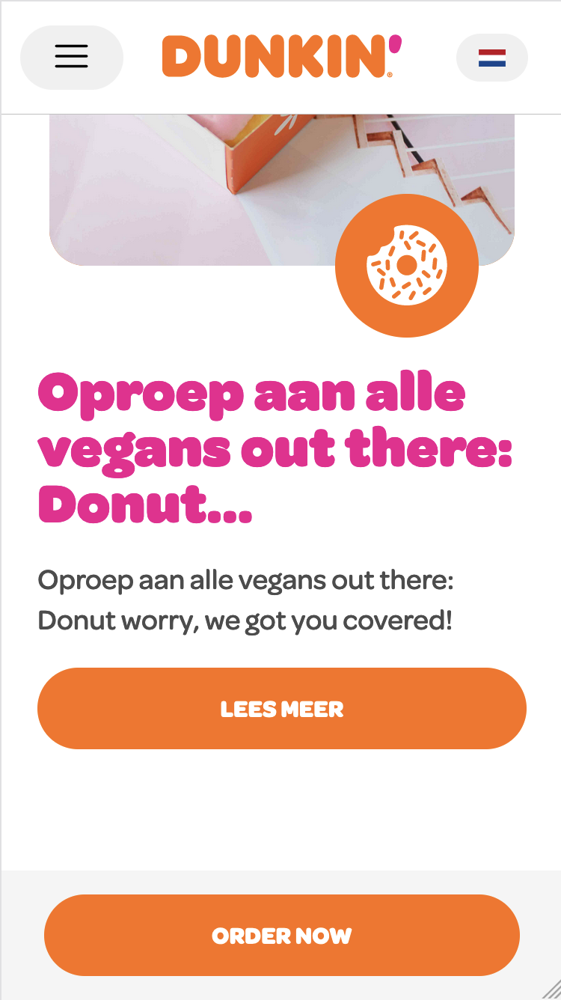
   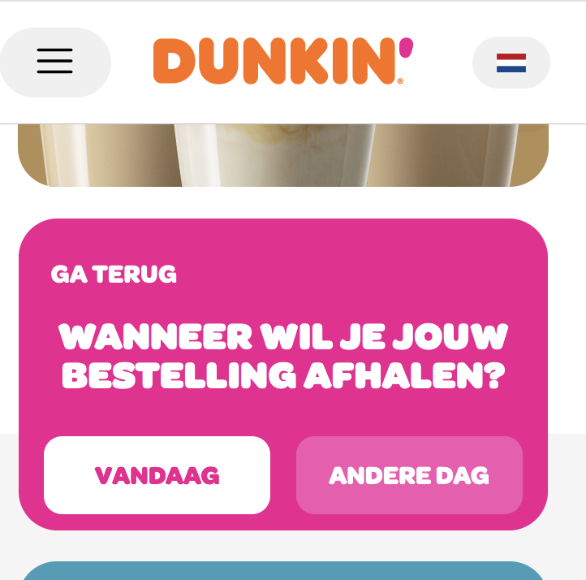
    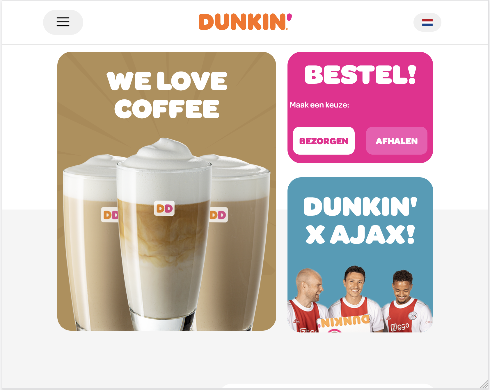

  ### Dit ging goed/Heb ik geleerd: 
  Korte omschrijving met plaatjes

Wat goed ging, was de html. Als het goed is heb ik alles semantisch neergezet en goed nagedacht over accessiblity.
 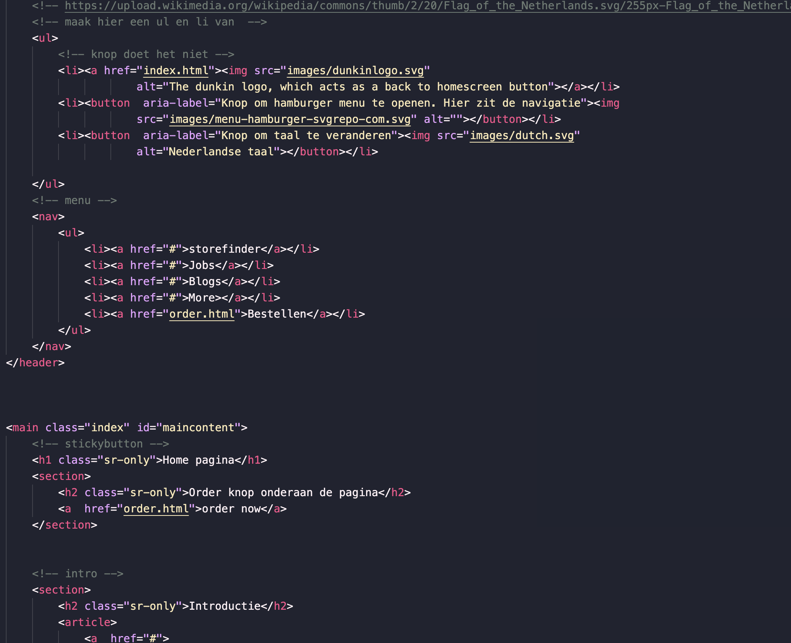

Grid werk ging na wat oefenen wel goed. Moest er eerst echt inkomen, maar daarna kon ik zo zelf een grid opstellen zonder steeds op te zoeken.
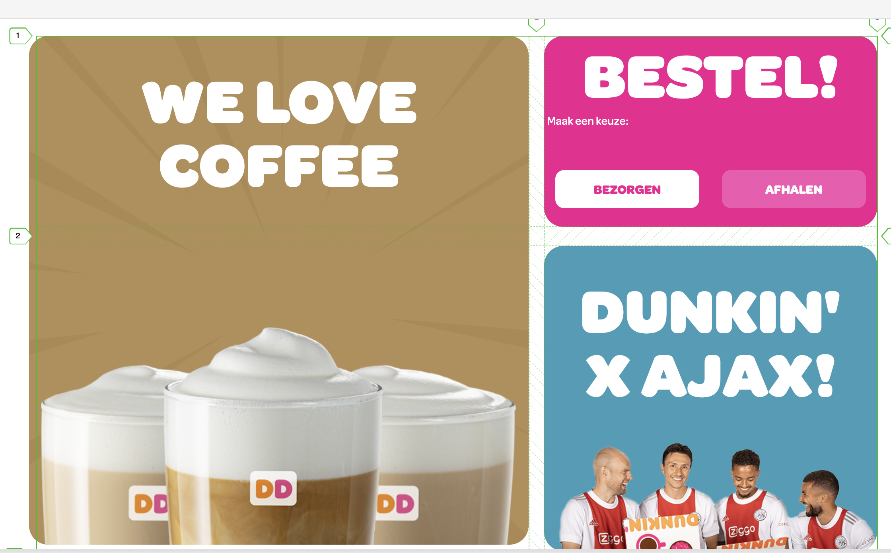

Ik heb nieuwe tags geleerd zoals aria-label, label, en ook classes voor screenreader only
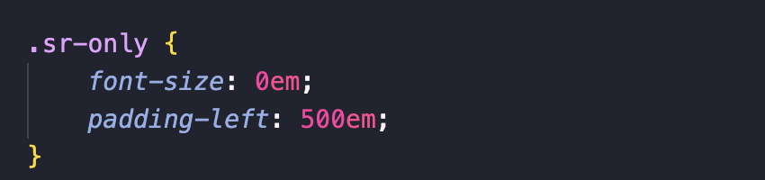

Ik heb geleerd om met root te werken. Eerst vond ik het dubbel werk met weinig css, maar toen ik heel veel had, was het heel fijn om maar een code regel aan te passen

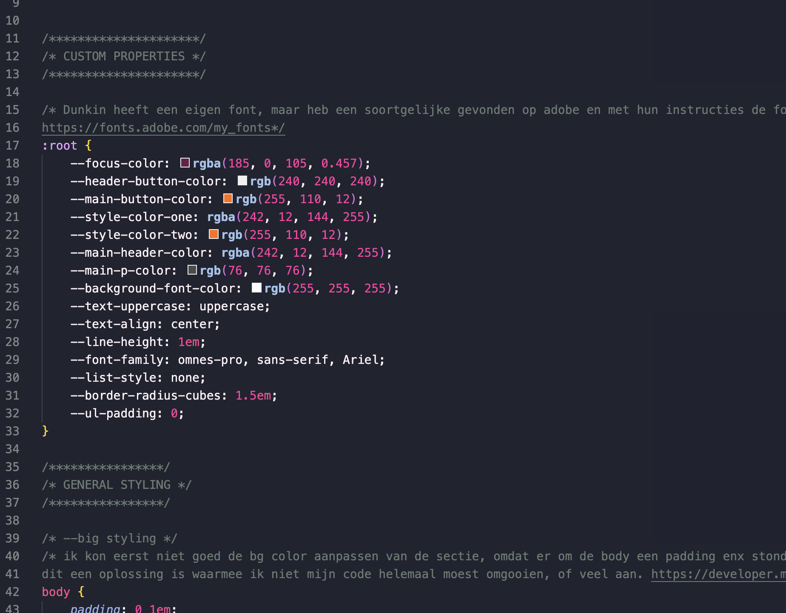

  ### Dit was lastig/Is niet gelukt:
  Korte omschrijving met plaatjes

Wat ik lastig vond, was om mijn css klein te houden. Op een gegeven moment verloor ik zicht en heb ik wegens tijdsnood niet verder gekeken naar dubbel werk. Aan het begin ging het wat beter, maar er kwam steeds meer bij en toen verloor ik structuur.
  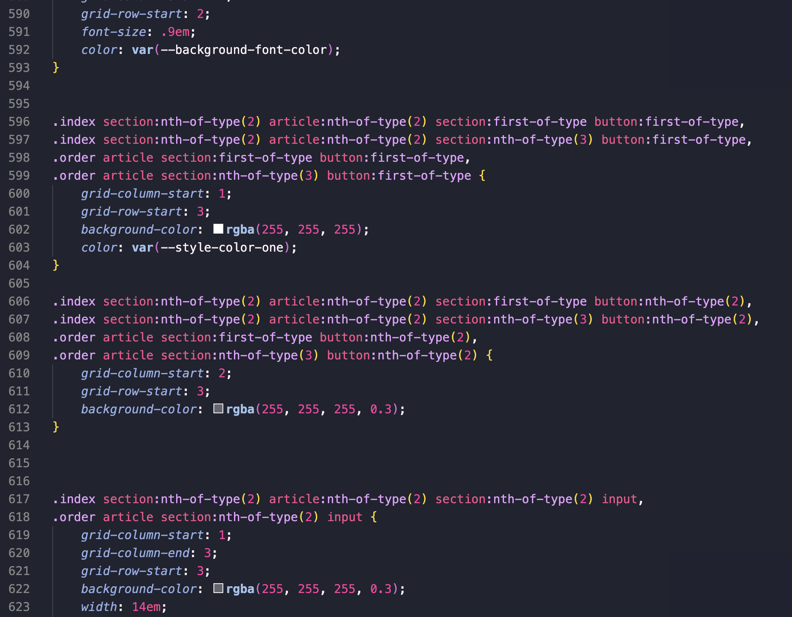

alles met js was heel lastig voor mij. Moest altijd hulp vragen en ik begrijp er eigenlijk not niet veel van. Dit was vooral bij mijn nav gebeuren.

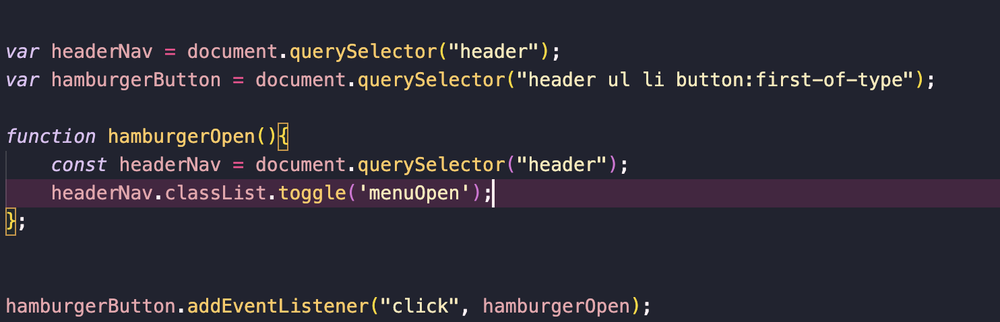

Over het algemeen vond ik het heel lastig.

Ik heb ook niet alle content erin dat vind ik ook jammer. 

## Bronnenlijst

  
continu bijhouden terwijl je werkt

  Nb. Wees specifiek ('css-tricks' als bron is bijv. niet specifiek genoeg). 
  Nb. ChatGpT en andere AI horen er ook bij.
  Nb. Vermeld de bronnen ook in je code.

  1. https://www.browserstack.com/guide/how-to-resize-image-using-css
  2. https://stackoverflow.com/questions/24052569/why-isnt-my-justify-content-property-working
  3.  https://stackoverflow.com/questions/14855157/css-move-multiple-list-item-to-the-right-and-up
  4. https://stackoverflow.com/questions/47865412/how-to-change-the-size-of-the-image-on-the-button-in-html-css
  5. https://upload.wikimedia.org/wikipedia/commons/thumb/2/20/Flag_of_the_Netherlands.svg/255px-Flag_of_the_Netherlands.svg.png
  6. https://www.dunkin.nl/ (ook voor de plaatjes)
  7. https://www.dofactory.com/css/buttons (how to style a button)
  8. https://www.terluinwebdesign.nl/en/css/position-sticky-not-working-try-overflow-clip-not-overflow-hidden/ (geprobeerd voor mijn sticky button)
  9. https://stackoverflow.com/questions/19188211/how-to-add-fixed-button-to-the-bottom-right-of-page
  10. https://www.google.com/search?client=firefox-b-d&q=how+to+position+fixed+with+flexbox 
  11. https://fonts.adobe.com/my_fonts (de font die ik heb gebruikt)
  12. https://developer.mozilla.org/en-US/docs/Web/CSS/grid-template-columns 
  13. https://www.w3schools.com/cssref/css3_pr_background-size.php
  14.  https://developer.mozilla.org/en-US/docs/Web/CSS/CSS_grid_layout/Basic_concepts_of_grid_layout
15. https://stackoverflow.com/questions/53199146/make-element-take-two-columns (overlay op twee colums grid)
16. https://css-tricks.com/inclusively-hidden/ (sr-only)
17. https://uit.stanford.edu/accessibility/concepts/screen-reader-only-content
18. https://developer.mozilla.org/en-US/docs/Web/CSS/CSS_selectors
19. https://developer.mozilla.org/en-US/docs/Web/HTML/Element/select (voor dropdown)
20. https://developer.mozilla.org/en-US/docs/Web/HTML/Element/label (onderzoek label)
21. https://www.svgrepo.com/svg/499592/close-x
22. https://www.sololearn.com/Discuss/3177679/how-to-sequence-multiple-text-animations-one-after-one (navigation fadeintext)
23. https://stackoverflow.com/questions/53199146/make-element-take-two-columns
24. https://www.w3.org/WAI/tutorials/images/decorative/#example-1-image-used-as-part-of-page-design
25. https://it.ucsf.edu/how-to/accessible-images-best-practices
26. https://developer.mozilla.org/en-US/docs/Web/CSS/Child_combinator
27. https://www.google.com/search?client=firefox-b-d&q=how+to+change+the+body+background+per+section+in+css
28. https://www.google.com/search?client=firefox-b-d&q=how+to+make+the+background+color+ovveride+the+madding+and+margin
29. https://developer.mozilla.org/en-US/docs/Web/CSS/gradient/linear-gradient
30. https://www.shecodes.io/athena/36202-how-to-remove-space-between-lines-in-css (line height)
31. https://css-tricks.com/almanac/properties/g/grid-row/
32. https://css-tricks.com/almanac/properties/g/gap/
33. https://developer.mozilla.org/en-US/docs/Web/CSS/CSS_flexible_box_layout/Ordering_flex_items
34. https://dev.to/neutrino2211/using-css-selectors-in-javascript-3hlm
35. https://www.freecodecamp.org/news/html-button-onclick-javascript-click-event-tutorial/
36. https://www.w3schools.com/css/css_form.asp
37. https://stackoverflow.com/questions/30557915/is-it-good-idea-to-make-separate-css-file-for-each-html-page
38. https://developer.mozilla.org/en-US/docs/Web/HTML/Element/label
39. https://www.w3schools.com/howto/howto_js_fullscreen_overlay.asp
40. https://developer.mozilla.org/en-US/docs/Web/CSS/:focus
41. https://developer.mozilla.org/en-US/docs/Web/HTML/Global_attributes/tabindex
42. https://webaim.org/techniques/skipnav/
43. https://stackoverflow.com/questions/23549507/tab-index-not-working-in-form
44. https://blog.devgenius.io/how-to-create-a-fade-in-animation-with-css-fd664da22cd9
45. https://www.sololearn.com/Discuss/3177679/how-to-sequence-multiple-text-animations-one-after-one
46. https://www.browserstack.com/guide/what-are-css-and-media-query-breakpoints
47. https://css-tricks.com/forums/topic/how-to-remove-script-for-responsive-media-queries/
48. https://developer.mozilla.org/en-US/docs/Web/API/Window/matchMedia

