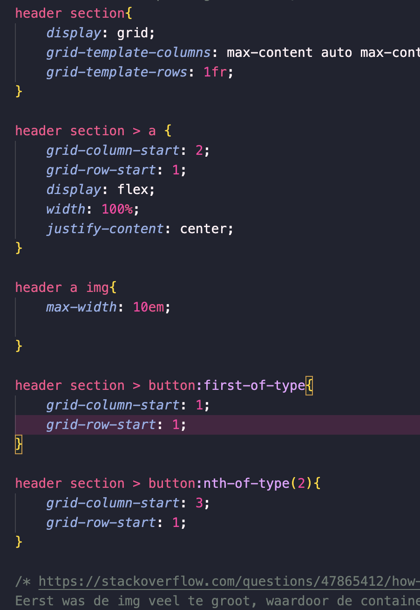

# Procesverslag
Markdown is een simpele manier om HTML te schrijven.  
Markdown cheat cheet: [Hulp bij het schrijven van Markdown](https://github.com/adam-p/markdown-here/wiki/Markdown-Cheatsheet).

Nb. De standaardstructuur en de spartaanse opmaak van de README.md zijn helemaal prima. Het gaat om de inhoud van je procesverslag. Besteedt de tijd voor pracht en praal aan je website.

Nb. Door *open* toe te voegen aan een *details* element kun je deze standaard open zetten. Fijn om dat steeds voor de relevante stuk(ken) te doen.

## Jij

  
uitwerken voor kick-off werkgroep

  ### Auteur:
  Charlotte Middelkamp

  #### Je startniveau:
  Blauw

  #### Je focus:
  Responsive
 

## Je website

  
uitwerken voor kick-off werkgroep

  ### Je opdracht:
  Dunkin https://www.dunkin.nl/

  #### Screenshot(s) van de eerste pagina (small screen): 
  Home page 
  

  #### Screenshot(s) van de tweede pagina (small screen):
  bestel page  
  
 

## Toegankelijkheidstest 1/2 (week 1)

  
uitwerken na test in 2e werkgroep

  ### Bevindingen
  Lijst met je bevindingen die in de test naar voren kwamen:

  1. De site is gemaakt in een online webmaker, waardoor de hele code niet semantisch is. 
  2. Er zijn gewoon geen headers??
  3. Als je er met de screenreader doorheen gaat, is het heel confusing.
  4. Veel alt tags kloppen niet of zijn er gewoon niet. 
  5. Er wordt niet duidelijk aangekondigd waar je eigenlijk bent op de pagina. Ik ging er doorheen en opeens begint het ding allemaal cijfers te vertellen. Dit was een plaatje dat dus ook niet goed was neergezet.
  6. Tekst staat gewoon los in een divje.
  7. De contrast is te laag bij hun 'p's. Het is lichtgrijs op een witte achtergrond. het had een score van onder de 2.
  

  dit nog verder typen

## Breakdownschets (week 1)

  
uitwerken na afloop 3e werkgroep

  ### de hele pagina: 
  

  ### dynamisch deel (bijv menu): 
  

  ### wellicht nog een dynamisch deel (bijv filter): 
  

## Voortgang 1 (week 2)

  
uitwerken voor 1e voortgang

  ### Stand van zaken

  hier dit ging goed & dit was lastig (neem ook screenshots op van delen van je website en code)

  Ik vind coderen opzich gewoon echt lastig en het enige wat goed ging was de de sections beslissen van mijn breakdown schets. Ik ben niet vergekomen met mijn site. Ik sla een dagje over en opeens mis ik een hele week. Wat ik vooral lastig vind, is dat ik bijna niks uit de site kan halen die ik gekozen heb. Ik snap niks van de code die daar staat, dus ik moet alles zelf doen. Ik probeerde ook een form te maken die aan het begin staat, maar ik zocht wat uitleg op en dergelijke, maar ik vind het echt lastig. 
  Ik heb al maanden niet gewerkt aan css, dus dit vond ik ook heel lastig om te doen. Ik zag de blokjes van de site en kon helemaal niet bedenken hoe ik dat moest namaken.

  navbar

  Wat niet goed ging, was het maken van  mijn navbar. Het was lastig om alle items goed te positioneren. Ik probeerde alle justify-content, maar niks werkte. Ik weet niet wat er mis ging, maar ik heb uiteindelijk besloten om mijn oude navbar van mijn eerder gemaakte site te kopieren en te plakken. 

  Toen heb ik een paar dingetjes aangepast om het passend te maken en het probleem was volgensmij dat ik de verkeerde tags aanriep. De flex werkte toen wel, maar hij zat nog naar rechts. Ik zat alles te bekijken en vond toen dat mijn ul een standaard padding had. Ik had dit eerst niet bedacht, omdat ik de bolletjes van de ul al had verwijderd. 

 
  Daarna was het dus vooral opstarten met weer css schrijven. Ik dacht niet te veel aan of het netjes was, maar eerder of het wel werkte.

  Eerste blokje coffee

  Daarna ging ik het blokje maken voor de koffie. Ik kon eerst niet uitvogelen hoe ik het precies moest stylen, dus heb ik de originele site bekeken en de css daarvan gepakt, en hem een beetje aangepast. Vanuit daar heb ik eigenlijk de hele code weer aangepast toen ik meerdere dingen moest toevoegen. Daarna had ik problemen met de content in het blokje. Het positioneerde niet goed. Ik was met flex en met grid bezig, maar niks werkte. Het probleem bleek de margin de zijn die de browser gaf. Verder had ik mijn koffie img die eruit viel. Lua hielp hier met overflow.
  
   
  sticky button

  Ik wist eerst niet hoe ik het goed moest positioneren. Ik had in de orginele css gekeken, maar hier kwam ik niet mee verder, want ik snapte de css niet. Ik heb een beetje online rondgekeken en kwam dus met sticky. voordat ik position absolute heb gebruikt, heb ik sticky geprobeerd, maar dat werkt niet omdat het plakt aan de container. ik moet hiervoor dus fixed gebruiken. Daarna had ik problemen met flex en fixed. Dit heb ik opgelost door beide de a en de containter een flex en fixed te geven.

  Daarna heb ik mijn css goed neergezet met kopjes en dergelijke.
 

  ### Agenda voor meeting

  | student 1      |
  | Hoe werkt grid en is mijn html goed ingedeeld       |
  

  ### Verslag van meeting
  hier na afloop snel de uitkomsten van de meeting vastleggen

  - Mijn nav stond verkeerd, mijn menu balk items zijn in principe niet de nav, maar de nav zit onder de hamburger
  - de manier waarop ik mijn menubalk heb gestijld kan handiger met grid, hiervoor uitleg gekregen
  - Uitleg gekregen over hoe ik mijn form in kan delen en hoe ik dit kan vormgeven in cs
  - ook punten gegeven over dat ik bepaalde content anders kan neerzetten omdat de originele site het op een confusing manier doet

  ### Voortgang na meeting

grid header

Na de meeting ben heb ik mijn header veranderd. Mijn nav was ergens anders en dat betekende dat de css ook anders moest. Ik ben van flex naar grid gegaan. Dit moest ik ook uitvogelen. Eerst moest ik opzoeken hoe ik eigenlijk de grid moest maken, maar ik vond dat lastig, dus heb ik om hulp gevraagd bij de docent. Hij had al instructies gegeven maar die werkten niet. We heb samen ernaar gekeken. De grid klopte niet, er was een rij bijgekomen. Het probleem was dat we in de css de html verkeerd hadden aangeroepen.

 

## Voortgang 2 (week 3)

  
uitwerken voor 2e voortgang

  ### Stand van zaken

  (grid werk)
  (bekijk de css)
  (2de roze button)
  (header styling)
  (root en algeme styling button)
  (favicon opgelsot)

  ### Agenda voor meeting
  samen met je groepje opstellen

  | student 1      | student 2          | student 3    | student 4        |
  | ---            | ---                | ---          | ---              |
  | dit bespreken  | en dit             | en ik dit    | en dan ik dat    |
  | en dat ook nog | dit als er tijd is | nog een punt | dit wil ik zeker |
  | ...            | ...                | ...          | ...              |

  ### Verslag van meeting
  hier na afloop snel de uitkomsten van de meeting vastleggen

  - punt 1
  - punt 2
  - nog een punt
- ...

## Toegankelijkheidstest 2/2 (week 4)

  
uitwerken na test in 9e werkgroep

  ### Bevindingen
  Lijst met je bevindingen die in de test naar voren kwamen (geef ook aan wat er verbeterd is):

## Voortgang 3 (week 4)

  
uitwerken voor 3e voortgang

  ### Stand van zaken
  hier dit ging goed & dit was lastig (neem ook screenshots op van delen van je website en code)

  ### Agenda voor meeting
  samen met je groepje opstellen

  | student 1      | student 2          | student 3    | student 4        |
  | ---            | ---                | ---          | ---              |
  | dit bespreken  | en dit             | en ik dit    | en dan ik dat    |
  | en dat ook nog | dit als er tijd is | nog een punt | dit wil ik zeker |
  | ...            | ...                | ...          | ...              |

  ### Verslag van meeting
  hier na afloop snel de uitkomsten van de meeting vastleggen

  - punt 1
  - punt 2
  - nog een punt
  - ...

## Eindgesprek (week 5)

  
uitwerken voor eindgesprek

  ### Je uitkomst - karakteristiek screenshots:
  

  ### Dit ging goed/Heb ik geleerd: 
  Korte omschrijving met plaatjes

  

  ### Dit was lastig/Is niet gelukt:
  Korte omschrijving met plaatjes

  

## Bronnenlijst

  
continu bijhouden terwijl je werkt

  Nb. Wees specifiek ('css-tricks' als bron is bijv. niet specifiek genoeg). 
  Nb. ChatGpT en andere AI horen er ook bij.
  Nb. Vermeld de bronnen ook in je code.

  1. https://www.browserstack.com/guide/how-to-resize-image-using-css
  2. https://stackoverflow.com/questions/24052569/why-isnt-my-justify-content-property-working
  3.  https://stackoverflow.com/questions/14855157/css-move-multiple-list-item-to-the-right-and-up
  4. https://stackoverflow.com/questions/47865412/how-to-change-the-size-of-the-image-on-the-button-in-html-css
  5. https://upload.wikimedia.org/wikipedia/commons/thumb/2/20/Flag_of_the_Netherlands.svg/255px-Flag_of_the_Netherlands.svg.png
  6. https://www.dunkin.nl/ (ook voor de plaatjes)
  7. https://www.dofactory.com/css/buttons (how to style a button)
  8. https://www.terluinwebdesign.nl/en/css/position-sticky-not-working-try-overflow-clip-not-overflow-hidden/ (geprobeerd voor mijn sticky button)
  9. https://stackoverflow.com/questions/19188211/how-to-add-fixed-button-to-the-bottom-right-of-page
  10. https://www.google.com/search?client=firefox-b-d&q=how+to+position+fixed+with+flexbox 
  11. https://fonts.adobe.com/my_fonts (de font die ik heb gebruikt)
  12. https://developer.mozilla.org/en-US/docs/Web/CSS/grid-template-columns 
  13. https://www.w3schools.com/cssref/css3_pr_background-size.php
  14.  https://developer.mozilla.org/en-US/docs/Web/CSS/CSS_grid_layout/Basic_concepts_of_grid_layout
15. https://stackoverflow.com/questions/53199146/make-element-take-two-columns (overlay op twee colums grid)
16. https://css-tricks.com/inclusively-hidden/ (sr-only)
17. https://uit.stanford.edu/accessibility/concepts/screen-reader-only-content

